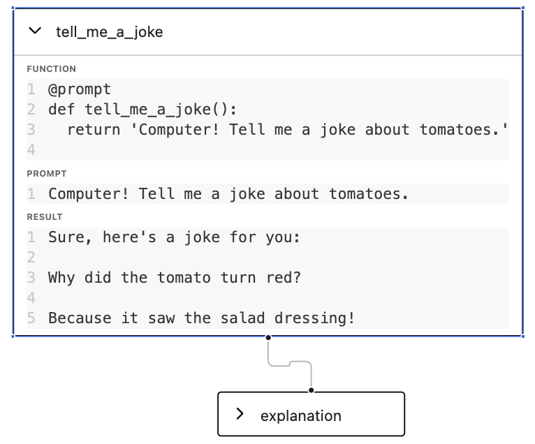
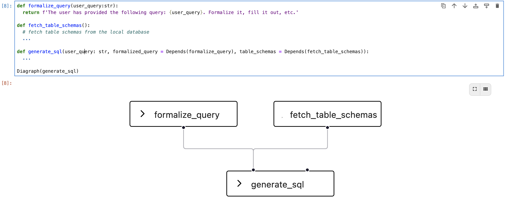
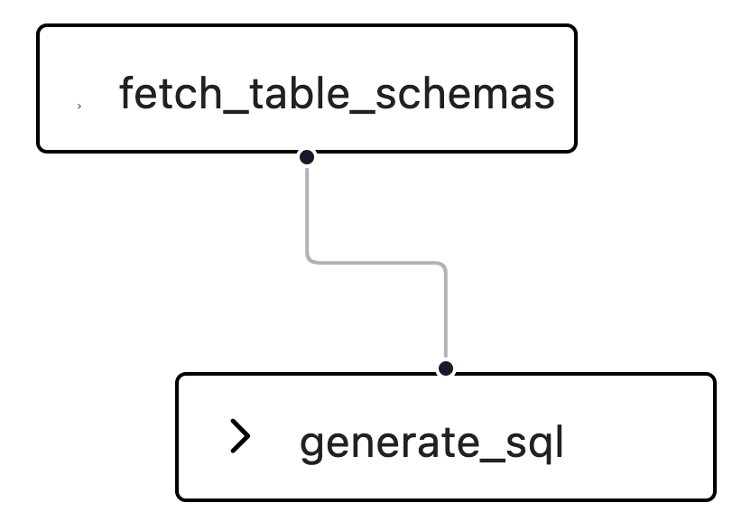
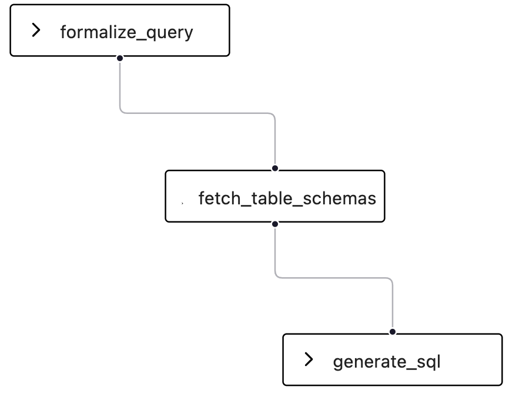
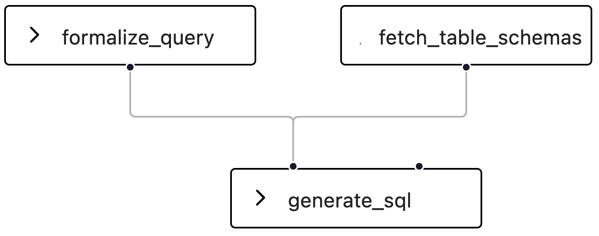
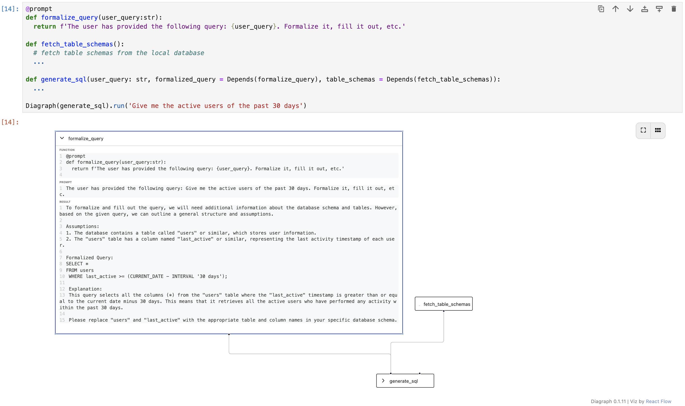

# Diagraph

Diagraph represents Large Language Model (LLM) interactions as a graph, which makes it easy to build, edit, and re-execute a chain of interactions.


## Quickstart

```bash
pip install diagraph
```


```python
from diagraph import Diagraph, Depends, prompt, llm

openai.api_key = 'sk-<OPENAI_TOKEN>'

@prompt
def tell_me_a_joke():
  return 'Computer! Tell me a joke about tomatoes.'

@prompt
def explanation(joke: str = Depends(tell_me_a_joke)) -> str:
  return f'Explain why the joke "{joke}" is funny.'

dg = Diagraph(explanation).run()
print(dg.result) # 'The joke is a play on words and concepts. There are two main ideas that make it humorous...
dg
```



## Features

### 👩‍💻 Build a graph by Expressing Dependencies as Parameters

```python
def fetch_table_schemas():
  ...

def generate_sql(user_query: str, table_schemas = Depends(fetch_table_schemas)):
  ...
```

### 🏃‍♀️ Cache and rerun parts of the graph, saving time and money

```python
dg[generate_sql].run()
```

### 🖼️ Visualize your graph in a Jupyter Notebook



## Motivation

### Who is this for?

Diagraph is primarily for Python developers looking to build software that leverage LLM interactions. It is designed as a low level tool for crafting interactions by hand.

### Why would I want this?

- **Refactoring is Easy:** Diagraph simplifies code restructuring. Specify dependencies using parameters for clean, readable, and _refactorable_ code.
- **Code Faster, Save Money:** Diagraph's ability to cache and rerun specific parts of the code saves on execution time and cuts down costs.
- **Quick Edits:** Edit interactions on the fly. Rewrite LLM results as well as functions.
- **Bring Your Own Code:** Use as much or as little as you want.
- **See The System:** Get a straightforward view of the graph with a built-in Jupyter visualization tool.

## Usage

### Building a Diagraph

Consider a scenario where you need an LLM to generate SQL code based on a user query, incorporating information about table schemas. Traditionally, you might structure it like this:

```python
def fetch_table_schemas():
  # fetch table schemas from the local database
  ...

def prompt_to_generate_sql(user_query: str):
  table_schemas = fetch_table_schemas()
  return openai.ChatCompletion.create(
    messages=[{
      "role": "user", 
      "content": f"Generate a SQL query for the user query: {user_query}. The table schemas are: {table_schemas}"
    }]
  )

return prompt_to_generate_sql('Fetch all active users for the past 30 days')
```

Now, imagine you want to run another function concurrently: you would have to rewrite your `prompt_to_generate_sql` function to call both dependent functions concurrently, ensuring you handle error cases, etc.

Diagraph lets you express your functions as a graph:

```python
def fetch_table_schemas():
  # fetch table schemas from the local database
  ...

def generate_sql(user_query: str, table_schemas = Depends(fetch_table_schemas)):
  return openai.ChatCompletion.create(
    messages=[{
      "role": "user", 
      "content": f"Generate a SQL query for the user query: {user_query}. The table schemas are: {table_schemas}"
    }]
  )

print(Diagraph(generate_sql).run('Fetch me all active users for the past 30 days').result)
```


Here are some key points:

1. Dependencies are expressed by passing them as parameters using `Depends(fn)`, a familiar pattern if you've used FastAPI.
2. `Diagraph(fn)` defines the graph. You provide the terminal nodes (final functions). You can pass multiple terminal nodes and get a tuple in return.
3. `run(*args)` accepts user input passed to each function. Multiple arguments can be provided.

Expressing dependencies as a graph allows for easy rearrangement of execution order. Suppose you want to add a step to formalize a user's query. Make it a dependency for `fetch_table_schemas`:
to `fetch_table_schemas`

```python
def formalize_query(user_query:str):
  return f'The user has provided the following query: {user_query}. Formalize it, fill it out, etc.'

def fetch_table_schemas(formalized_query = Depends(formalize_query)):
  # fetch table schemas from the local database
  ...
```



Diagraph automatically inserts the new function at the top of the graph. If `fetch_table_schemas` doesn't need the formalized query, simply move the dependency to `generate_sql`:


```python
def formalize_query(user_query:str):
  return f'The user has provided the following query: {user_query}. Formalize it, fill it out, etc.'

def fetch_table_schemas():
  # fetch table schemas from the local database
  ...

def generate_sql(user_query: str, formalized_query = Depends(formalize_query), table_schemas = Depends(fetch_table_schemas)):
  ...
```



Now the first two functions execute concurrently, and the final `generate_sql` query receives both functions' results as arguments.

### Re-execution

Encountering a syntax error at the end of a long chain of LLM interactions can be exasperating.

Diagraph comes to the rescue by enabling selective re-execution of parts of your graph, leveraging cached results from prior runs. Consider the following example:

```python
def formalize_query(user_query:str):
  return f'The user has provided the following query: {user_query}. Formalize it, fill it out, etc.'

def fetch_table_schemas():
  # fetch table schemas from the local database
  ...

def generate_sql(user_query: str, formalized_query = Depends(formalize_query), table_schemas = Depends(fetch_table_schemas)):
  ...

dg = Diagraph(generate_sql)
```


Assume both `formalize_query` and `fetch_table_schemas` executed successfully, but `generate_sql` encountered a failure. Rerun that specific function with:

```python
dg[generate_sql].run()
```

Selecting a function with `dg[fn]` prompts Diagraph to run the subgraph starting from the specified node and running downstream. Any ancestors automatically reuse their cached results. Multiple nodes can also be rerun simultaneously using `dg[fn1, fn2, fn3].run()`.

Nodes can be dynamically edited on the fly. For instance, modify a cached result:

```
dg[formalize_query].result = 'My fake formalized result'

dg[generate_sql].run()
```

Functions can also be edited on the fly:

```python
def new_formalize_query():
  ...

dg[formalize_query] = new_formalize_query

dg[formalize_query].run()
```

When editing a node, use the original function as a key - here, `formalize_query`.

### Visualizations

Larger graphs can be complicated to visualize. If you're in a Jupyter notebook, Diagraph provides a handy visualization tool for inspecting your graphs.

Simply return a diagraph to view it:


You can open a node to view its function, prompt, and result:



### Prompt

Diagraph accepts regular functions, but functions decorated with the `@prompt` decorator sprout superpowers.

Decorate a function with `@prompt` and return a plain string:

```python
@prompt
def formalize_query(user_query:str):
  return f'The user has provided the following query: {user_query}. Formalize it, fill it out, etc.'
```

The returned string is automatically passed as a prompt to the LLM (default is OpenAI GPT-3.5-turbo).

`@prompt` accepts additional arguments:

```python
from diagraph import OpenAI

def handle_log(event, data):
    if event == 'start':
        print('*' * 20)
    elif event == 'end':
        print(f'\n')        
    else:
        print(data, end='')

def error(e: Exception):
  print(e)
  raise e


@prompt(
  llm=OpenAI('gpt-4'),
  log=handle_log,
  error=error_handler
)
```

These same arguments can be passed to the Diagraph constructor as well, to apply to all nodes:

```python
Diagraph(terminal_node, llm=OpenAI('gpt-4'), error=error_handler, log=handle_log)
```

Or can be set at a global level:

```python
Diagraph.llm = OpenAI('gpt-4')
Diagraph.error=error_handler
Diagraph.log=handle_log
```

Parameters defined at the node level take precedence over Diagraph level, which takes precedence over global levels.

## License

[MIT](LICENSE)
